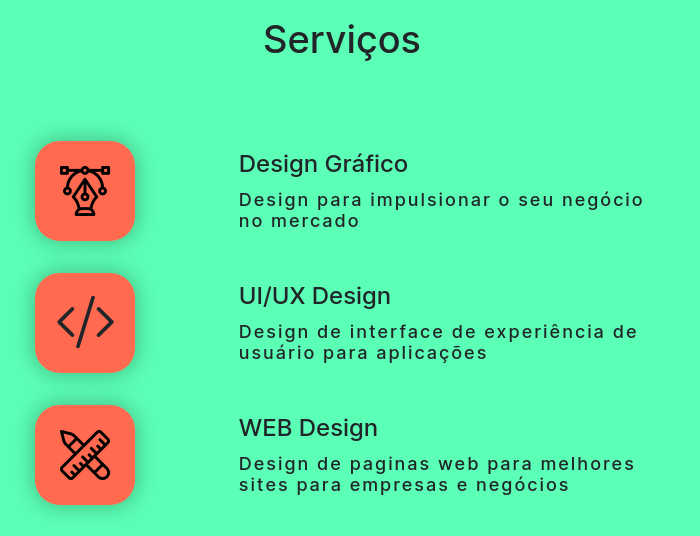

# Portfolio de Gabriel | RedCat

Este projeto é o meu portfólio pessoal, desenvolvido em React com TypeScript usando o Vite. A construção deste site não apenas serviu como uma apresentação do meu trabalho, mas também como uma oportunidade de aprimorar minhas habilidades em React e Typescript.

## Tecnologias Utilizadas

- **React:** A biblioteca JavaScript para criar interfaces de usuário.
- **TypeScript:** O superset de JavaScript para adição de tipagem estática.
- **Vite:** Um construtor de aplicações web rápido e flexível.
- **SASS:** Uma extensão do CSS que facilita a escrita de estilos mais complexos.

## Funcionalidades e Destaques

- **Formulários Funcionais:** Implementação de formulários interativos usando React, incluindo validação e envio de dados para uma API.
  
- **Renderização de Componentes:** Demonstração da criação e renderização de componentes reutilizáveis, proporcionando uma estrutura modular ao projeto.

- **Integração com API:** Utilização de uma API para obter ou enviar dados, exibindo habilidades de integração e manipulação de dados externos.

- **Estilização com SASS:** Aplicação de estilos consistentes e aprimorados ao projeto usando SASS, tornando a estilização mais modular e fácil de manter.

- **UI Design:** Foco na experiência do usuário através de um design intuitivo e amigável, refletindo o cuidado com a estética e usabilidade.

## Screenshots

